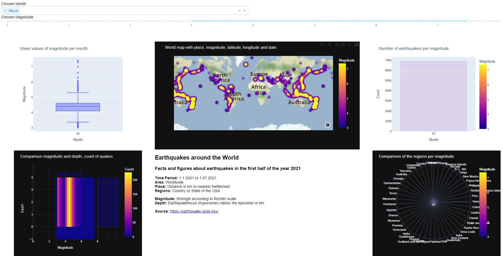
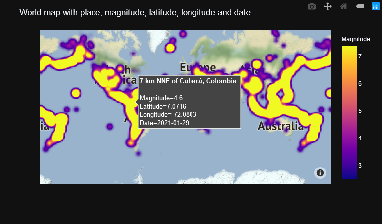
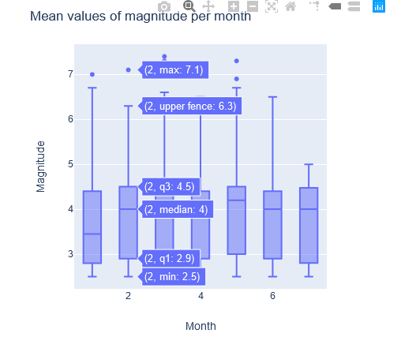
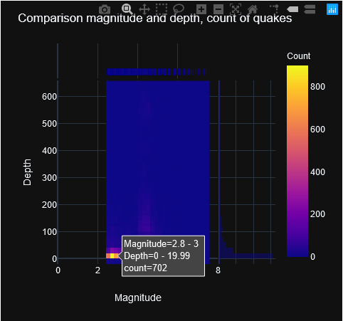
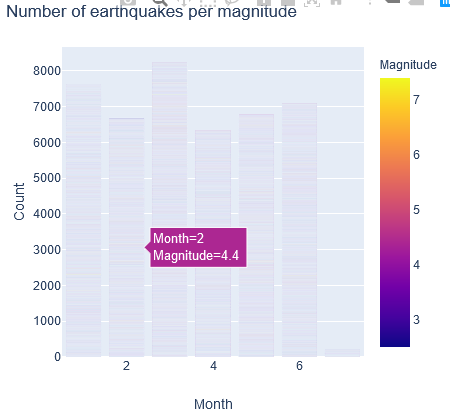
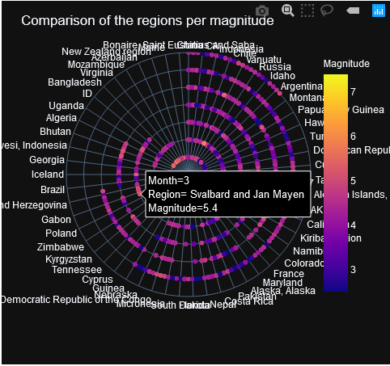

# Dashboard on Earthquakes

## Idea
This dashboard was part of my studies in Information and Data Management. For the course in Advanced Visualization, we had to build 
a dashboard in small groups, on a dataset to our liking using one center visualization and at least four additional smaller ones.
In addition to that the dashboard had to be interactive.
This is the result.

## Installation
To run the dashboard the following modules have to be installed:
- `Python 3.8`
- `Dash`
- `Pandas`
- `Plotly`

The dashboard can be run with Dashboard.py

That starts the webtool, and the dashboard can be opened by calling the IP-address in your browser.

## Dataset
For the dashboard we used a dataset on all the earthquakes between January 1st to July 1st 2021. 
The following attributes from the dataset were kept to be used in the dashboard:
- Time
- Date (separate in Day, Month, Year)
- Latitude
- Longitude
- Depth
- Magnitude
- Distance (to the nearest settlement)
- Region (country or state in the US)

The data has been provided by an official site of the US-Government.
[https://www.usgs.gov/programs/earthquake-hazards/earthquakes]( https://www.usgs.gov/programs/earthquake-hazards/earthquakes)

##Interactions
There are two possible interactions with the dashboard.

###Dropdown
The dashboard lets you choose one or more months for which the data should be visualized. If nothing is chosen, the whole dataset will be displayed.

###Ranged Slider
In addition, it's also possible to select the visualized earthquakes having a specific magnitude.
That can be done by a ranged slider, which lets you chose a range between 0 and 7.5 in 0.5 steps.

## Visualizations
The chosen dataset gets visualized by five different plots.
###Main Plot - World map
As the main visualization we chose a world map, where all earthquakes that fit the chosen parameters (Month/Magnitude) are represented by a dot on the map, according to longitude/latitude and
the magnitude. The longitude/latitude defines where on the map the point is, and the magnitude is shown through the color of the dot.
By hovering over selected dots, more information on the earthquake is shown.

###Boxplot
As a second visualization we chose a boxplot, which shows the mean of the magnitude in a month. When hovering over the boxes, you can get additional information,
such as median, quartile, maximum or minimum.

###Heatmap
To visualize the total of earthquakes in relation to depth and magnitude, we chose to use a density heatmap.
You can gain information on how many earthquakes happened in a certain depth, with a certain magnitude.

###Barplot
With the help of a barplot, it's possible to gain insights on the amount of earthquakes of a specific magnitude in a certain month.
This visualization is more helpful, when limits to the parameters have been set, otherwise there is too much information displayed. 

###Polarchart
The last plot selected is a polar chart. It shows information on the spread of magnitude in one month in an area or country.

